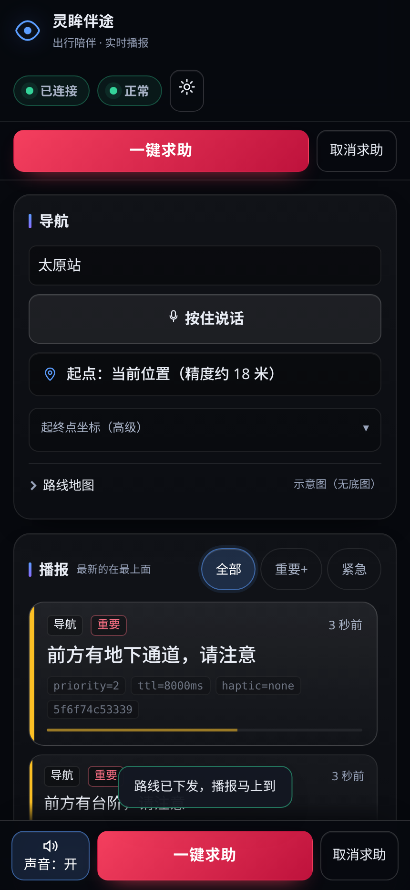

# 灵眸伴途

基于视觉语言模型的视障人士出行辅助系统 —— 后端原型。

手机摄像头看世界，AI 用自然语言说给视障人士听。

> **当前阶段：四层逻辑已实现，外部依赖仍是 mock，各组并行开工。**
>
> 已写实：风险分级、措辞生成、跌倒状态机、求助状态机、无障碍路线过滤。
> 未接入：云端 VLM、检测模型、地图 API、短信/推送通道。
>
> | 想知道 | 去哪看 |
> | :--- | :--- |
> | 怎么跑起来 | 本文档下方 |
> | 接口字段 | [docs/api-contract.md](docs/api-contract.md) |
> | **为什么这么设计** | [docs/design.md](docs/design.md) |
> | 谁做什么、进度 | [工作管理.md](工作管理.md) |
> | 设计中的已知问题 | [文档-设计中的问题.md](文档-设计中的问题.md) |
> | **接下来做什么、要改哪些接口** | [新功能与接口改动.md](新功能与接口改动.md) |
> | **待处理的遗留问题** | [问题-待处理的一些遗留问题.md](问题-待处理的一些遗留问题.md) |

---

## 快速开始

```bash
pip install -r requirements.txt      # 纯 Python，无编译
cp .env.example .env                 # 不填任何 key 也能完整跑通

bash scripts/smoke.sh                # 一键自检：起服务 -> 打全部路由
```

手动起服务：

```bash
uvicorn app.main:app --reload --host 0.0.0.0 --port 8000
```

`--host 0.0.0.0` 是为了让同局域网的其他设备（组员的前端）能连上。

起来之后有**两个页面**要用（播报界面 + 帧源模拟器），地址和分工见下一节
「前端页面」。

---

## 前端页面 —— 两个页面，一个端口

起服务后直接开 **<http://127.0.0.1:8000/>**：

```bash
uvicorn app.main:app --host 0.0.0.0 --port 8000
```

零构建、零 npm：静态文件由后端直接托管在 `/` 和 `/static/*`。

一共三个地址，**两个页面需要同时开着**（原因见下）：

| 页面 | 地址 | 是谁 | 干什么 |
|---|---|---|---|
| ① 播报界面 | <http://127.0.0.1:8000/> | 用户（看不见屏幕的人） | 交付形态：只看播报、只看求助 |
| ② 开发者面板 | <http://127.0.0.1:8000/?dev=1> | 开发 / 验收 | 契约验证用的测试件（默认隐藏） |
| ③ 帧源模拟器 | <http://127.0.0.1:8000/static/sender.html> | 演示者 / 设备端替身 | 喂帧，并做「帧 ↔ 播报」对照 |

播报界面分两层，**默认只显示第一层**：

| | 是什么 | 里面有什么 |
|---|---|---|
| ① 手机视图 `#app` | 交付形态的形状：按手机使用逻辑排 | 播报流（最新在最上面）、导航 + 路线地图、底部大按钮（播报开关 / 一键求助 / 取消求助）。紧急播报（`priority=3`）**顶成全屏**，`ttl` 到点自动收起 |
| ② 开发者面板 `#devPanel` | **契约验证用的测试件，默认 `hidden`** | 其余路由、请求日志、会话统计、`/v1/health` 明细 |

第二层的入口有两个：地址栏 `?dev=1`，或右上角 ⚙；选择记在 `localStorage`，
`?dev=0` 收起。**「藏起来」是 `hidden` 而不是删掉** —— 前端 JS 一律按 id
取 DOM，元素真被删掉会当场报错；而其余路由这些验证契约的东西，随时要能
翻出来。



> 上图是实测截图（430×932 的手机视口）。顶栏两枚状态药丸是 WS 连接状态和
> `/v1/health` 的结果 —— 手机上**只报「正常 / 降级」两个词，但一定得报**：
> 用户若不知道系统哑了，会把「没出声」理解成「环境安全」。播报流里每条都标着
> `source` / `priority` / `ttl` / `haptic`，并带一条 TTL 倒计时条（走完即过期褪色）。
> 播报流里**最新那条按「主角」排**（正文 20px、优先级色带加宽、底色更亮），
> 其余条目回到常规尺寸 —— 看这一屏的是低视力用户与陪同者，两拨人问的是
> 同一个问题「刚才说了什么」，所以这个问题在版面上先被答掉。

开发者面板里只剩一类测试件：**其余路由** —— 跌倒信号 / 取消求助 /
推进时钟（跑完升级链）。帧源搬去了下面这一页。

### 导航：目的地与起点（`web/js/voice.js` / `web/js/nav.js`）

导航卡里那枚「按住说话」是目的地那一格的主要输入方式。看不见屏幕的人打字要多
难受有多难受：先调出屏幕键盘，再在一个看不见的输入框里逐字确认。**按住 → 说话
→ 松开**把这步压成一次按住，而且状态长在手指上 —— 不存在「忘了关」（点一下
开始、再点一下结束那种，要求用户用耳朵记住当前是开是关）。

**两条输入方式，一条提交路径。** 目的地有两个开头 —— 按住说话、打字回车
（手机软键盘上那颗「前往」就是回车，`enterkeyhint="go"`）—— 但只能有**一条**
请求路径，所以两者都汇进 `nav.js::submitRoute()`。序列是
**落进输入框 → 念一遍「目的地：X」→ 出发**：先把听到的报出来，识别错了用户
当下就能开口纠正，而不是等路线播报出来才发现去的是别的地方。

原先这条路上横着一枚「开始导航」按钮。它对用户已经完全多余（语音松开即走、
打字敲回车），而且留着它就等于说「这条路必须有一个按钮」—— 语音那边当时正是
靠 `button[data-dest].click()` 去按它。按钮连根删掉之后，两条输入直连同一个出口
（`tests/test_api.py::test_navigation_has_exactly_one_submit_path` 钉住）。

**起点 = 当前位置，进页面自动取。** 这一页服务的是**正在走的人**，起点就是他
此刻在哪，没有第二种可能 —— 所以它不是一道要用户先意识到、再去按的选择题。
拿不到定位（没权限 / 不是 HTTPS / 不是 localhost）时**如实降级并出声**：起点框
改成「默认坐标（原因）」并标黄，同时走一条播报说明「这次按默认坐标规划，可能
不是你此刻的位置」。那一刻没有任何按钮被按过，不说的话用户会以为路线是从他脚下
算的。

卡片里那个框是**读数 + 重试**：写的就是起点从哪算的，点一下即重新定位
（`#geoBtn` / `#geoTxt`）。原先「重新定位」按钮和旁边那行状态字是两块 —— 读屏
用户得先弄清那行字讲的是哪件事、又要去按哪个按钮，而这两件事本来就是同一件。

两个容易踩的坑都钉了用例：`touch-action: none` 是长按的**功能前提**（不关掉
浏览器手势，长按会变成选中/滚动，`pointerup` 收不到，交互直接废）；收尾
**不能只靠 `onend`**（实测桩引擎少发一次 `onend`，按钮就会永远停在
「识别中…」，而用户以为自己还在录）。浏览器不支持（Firefox 至今没有）时，
按钮直接写「语音不可用」并说明原因，不假装能用。

还有一类失败值得单说：**语音识别用的是浏览器厂商的云服务**（Chrome / Edge 走
Google，Safari 走 Apple），所以 Chromium 裸构建、或到 Google 的网络不通时，
长按松开后 `error` 就是字符串 `network`。那不是本项目的后端断了 —— 这两件事
必须分开说，否则用户会去查一个根本没坏的东西。所以这一条单列措辞（琥珀标记
+ 一条能翻回来重看的播报：「语音识别靠浏览器厂商的云服务，现在连不上 —— 不是
本项目的后端。请直接打字。」），第二次起只说短句。按钮**不会**被标成「语音
不可用」：网络是会回来的，标死等于假红，用户从此不再试一个其实能用的功能。

### 播报出口 —— 排序 / 打断在前端（`web/js/speech.js`）

`docs/design.md` D11 把「排序、打断、积压保护、到期不补播」划给了**端侧**
（服务端观察不到喇叭，模拟播放状态连出过两个「永久静默」的 bug）。契约里的
`priority` / `interrupt` / `ttl_ms` 就是留给这一半用的 —— 所以这一半必须真的
有人做，否则**耳朵会落后于现实**：中文 TTS 约 250ms/字，一条 15 字的播报要念
3.7 秒，而无条件排队会让队列单调增长，用户听到的是十几秒前的那个**位置**。
听见错的，比什么都没听见更坏。

| 情况 | 做法 |
| :--- | :--- |
| `priority=3`（跌倒 / 求助）或 `interrupt` | 立刻 `cancel()` —— 一个字都不许挡在前面 |
| 队列里已经有 1 条在等 | 整批砍掉再念新的（排队那几条的 ttl 也差不多到了） |
| 其余 | 排在后面 |

砍掉多少条记在 `speechStats().dropped` 里 —— 「怎么少听见一句话」要能查出来。
同一处还管两件事：**语速**（播报流下方的「语速 1×」，按一下换档并**当场念一句**
给你听，因为语速只能用耳朵判断），以及**可用性自检**（`getVoices()` 里没有中文
嗓音、或浏览器根本没有语音 API 时，开关直接写「声音：不可用」，绝不亮着
「声音：开」装安静）。

**状态变化也走播报流**：网络断开超过 5 秒、健康检查从正常变降级，都会生成一条
`system` 播报（`ui.js::localNote`）—— 它同时进 TTS、进读屏（TTS 关掉时 `#feed`
的 `aria-live` 是 `polite`），也留在流里能被翻回来。恢复时如实说出**断了多少秒**。
生死按钮（一键求助 / 跌倒信号）按下就先震一下、先念一句「正在请求帮助」，
不等网络往返 —— 弱网下那几秒里，用户至少知道按到了。

### 帧源模拟器 —— 喂帧的那一端

**<http://127.0.0.1:8000/static/sender.html>**（开发者面板「帧源」卡片里
也有入口按钮）

- **帧源 ①视频抽帧** —— 读 `data/demo.mp4`，感知/安全两条流水线**各自独立
  发包**（频率可调），这就是 design.md D2 的两条解耦流水线。
  视频 404 就先跑 `python scripts/make_test_video.py` —— `demo.mp4` 是
  gitignore 的产物，fresh clone 里没有。
  ★ **换自己的素材要注意编码**：H.265/HEVC 在 Linux 的 Chrome 上**解不出来**
  —— `readyState`、时长、时间轴全都正常，就是不给画面（`videoWidth=0`），
  而且既不抛错也不触发 `error`。帧源页会直接说「这段视频浏览器解不出来」，
  但根子得在素材上解决，ffmpeg 转一道 H.264 即可：

  ```bash
  ffmpeg -i 原始.mp4 -c:v libx264 -crf 23 -pix_fmt yuv420p \
         -movflags +faststart -c:a aac data/demo.mp4
  ```
- **帧源 ②摄像头** —— 只留接口占位。接入时换成 `getUserMedia` 取流，
  复用同一个 `sendFrame()`，后端不用改。
- **帧源 ③单张图片** —— 拖拽即可，不依赖 demo.mp4。

**为什么帧源不放在播报界面里**（2026-09-23 搬走）：

- 帧源属于**设备端**。真机上这一端是摄像头，不是网页里的一段视频 ——
  不该让「交付形态」背着一台演示机。
- 播报界面服务的是**看不见屏幕**的人。视频条哪怕只有 88px，也是从播报流
  和求助按钮那里拿走的。
- 分开之后两边各走各的：模拟器在笔记本上喂帧、播报界面在手机上看结果
  —— 这正是真机的拓扑。

**两页的分工，一句话说清**：帧源页只管喂帧（抓帧 → `POST /v1/frame`），
播报界面只管看结果（每条播报都只从 `WS /v1/stream` 来）。

> ★ **播报界面自己不喂帧**，所以单独打开它时播报流**必然是空的** ——
> 那不是页面坏了。先开帧源模拟器点「开始发帧」，再回来看这里。
> 用户若不知道这一层，会把「没动静」理解成「环境安全」。
>
> ★ **必须是同一端口下的子页**，不能另开一个端口：跨端口会把 `demo.mp4`
> 变成跨域资源，`drawImage()` 之后 `canvas.toBlob()` 会因画布被**污染**直接抛
> SecurityError —— 表现是「按钮变成停止发帧，一帧都没发出去」，正属于本项目
> 最不能接受的沉默失效。同一端口没有这个问题；将来接 `getUserMedia` 也少一条
> 来源限制（`127.0.0.1` 算安全上下文，局域网 IP 不算）。

**「帧 ↔ 播报」对照怎么用**：帧源页右上那张大图就是**刚发出去的那一帧**
（与上传给后端的是同一份像素，不是「视频现在播到哪儿」—— 两者差着好几拍），
下面按时间倒序列出历史条目（缩略图 + `来源 · idx · 产出 N 放行 M` + 这一帧
被读成了什么）。**播报界面里该出现的就是这里没被划掉的那些**。

对不上时，三种故障在这一栏里长得完全不一样：**没有条目**＝帧没发出去
（看左边的视频和状态行）；**有条目但没文案**＝模型没看出东西；
**文案标着「闸门丢弃」**＝读对了，但被闸门当重复/过期吃掉了。

> 对照区是**调试用**，不是第二条渲染路径 —— 播报界面上的每一条仍然只从
> `WS /v1/stream` 来，否则 WS 断了你也看不出来。这一页也刻意不做 TTS / 震动：
> 看它的是演示者，不是用户的耳朵。

> `map.js` 是全套代码里**唯一**依赖第三方运行时的地方（百度 JSAPI GL，
> 从 CDN 加载）。它满足三条约束：失败**只落在自己的卡片里**（不碰
> `window.onerror`、不进请求日志）、**没有它时页面照常工作**、以及
> **不会用模态框把整页冻住**。最后一条是实测出来的：百度在 AK 校验失败时
> 是直接 `alert()` 的，那个模态框在手机上会挡住底部「一键求助」，而且只有
> 用户手动点掉才消失 —— 所以加载期间由 `map.js` 接管 `window.alert`，
> 把原话留下当降级原因。
>
> 还有一条同样来自实测：**建图成功 ≠ 画得出来**。GL 渲染器起不来时它既不抛
> 异常也不报错，只留下一块空白底图（卡片上却写着「底图 = 百度」）——
> 正是这套系统最忌讳的沉默失效。所以建图后会再确认一次 `#map` 里真的出现了
> canvas，没有就退回纯 SVG 的无底图示意图并如实说明原因（手机 WebView /
> 省电模式下拿不到 WebGL 是常态，不是边缘情形）。

> **页面顶部出现红条「页面没能启动」怎么办**：多半是浏览器缓存了旧版本的前端
> 文件。两个页面都自带启动自检（`web/js/boot-check.js`，唯一一段 classic
> 脚本，排在 module 入口之前）：入口或它 import 的任何一个模块没跑起来，整个
> 模块图就一行都不执行，页面只会停在「连接中…」「检查中」这类初始文案上 ——
> 看起来像网络慢，实际一行 JS 都没跑。按 **Ctrl+Shift+R** 强制刷新即可。
> 后端也给 `/` 和 `/static/*` 发了 `Cache-Control: no-cache`（回源确认，
> 带 ETag，没变就是 304），所以正常情况下不该再撞上。

端侧发图走**统一入口 `POST /v1/frame`**（multipart），两个页面共用这一个出口，
字段见 [docs/api-contract.md](docs/api-contract.md) §4.0。

---

## 跑一遍测试素材

先生成测试视频（手写 SVG → PNG → mp4）：

```bash
python scripts/make_test_video.py    # 需要 ffmpeg；SVG 渲染自动挑 rsvg-convert 或 Chrome
```

然后喂给后端看产生了哪些播报：

```bash
python scripts/run_video.py data/demo.mp4
python scripts/run_video.py data/frames --source images    # 也可以用图片序列
python scripts/demo_fall.py                                # 跌倒全流程演示
```

另开一个终端看实时推流：

```bash
python scripts/ws_probe.py
```

---

## 核心设计

**全系统只有两个数据结构。**

```
Frame         所有接口的输入
Announcement  所有接口的输出
```

十条路由全部「入 `Frame`，出 `Announcement`」（九条 JSON + 一个 multipart 统一帧入口），四层的差异只体现在
`source` 字段和 `detail` 的形状上。端侧拿到播报**只播 `text`** 加执行
`haptic` 震动，不需要理解 `detail` 的结构 —— 但**要读 `priority` /
`interrupt` / `ttl_ms` 做播放排序和到期判断**（详见 design.md D11）。

几条关键规则（完整推导见 [docs/design.md](docs/design.md)）：

- **感知与安全是两条解耦的流水线。** 云端 VLM 单次调用 1–3 秒，对避障来说
  完全不可接受，所以第二层绝不能走 VLM。这是本项目最重要的架构主张。
- **TTL 过期即丢。** 迟到 3 秒的「前方 2 米有台阶」比不播更危险。
  由**端侧**执行（契约里 `ttl_ms` 就是「从端收到起算」）—— 服务端不排队，
  也就不存在「排到他时已过期」这回事。
- **服务端只做闸门。** 只去重、丢废数据；排序 / 打断 / 积压归端侧。
  详见 [docs/design.md](docs/design.md) D11 —— 那里记着为什么。
- **去重键必须含风险等级和距离档位。** 否则风险升级会被当成「同一物体的
  重复」吞掉 —— 被吞的恰恰是最危险那条。
- **跌倒 `suspected` 态永不自动外呼。** 真跌倒和「把手机扔到床上」在加速度计
  上几乎无法区分。

---

## 目录

```
app/
  contracts.py          ★ 接口契约单一真源（只有标准库依赖）
  config.py             读 .env
  main.py               Starlette 装配（只装配，实现都在下面几处）
  paths.py              BASE_DIR / WEB_DIR / DATA_DIR / UPLOAD_DIR
  api/                  HTTP 与 WS 层
    envelope.py         统一信封：入 Frame，出 Announcement
    hub.py              WS 播报通道（/v1/stream）
    uploads.py          ★ 统一帧入口 POST /v1/frame（multipart）
    routes.py           路由表 + tick / health / 前端配置
  core/
    registry.py         实现注册表
    arbiter.py          ★ 播报闸门（只做去重 + 废数据过滤）
    rules/              ★ 各层业务规则（可单独测试）
      risk.py             障碍物风险分级（悲观距离、置信度门限、TTL）
      phrasing.py         措辞生成（不播数字、置信度对冲、短句降级）
      scene.py            场景分类（决定去重粒度）
      fall.py             跌倒状态机
      sos.py              求助状态机（幂等、升级链）
      route.py            无障碍策略（过滤 / 警告 / 措辞，不拿数据）
    layers/             四层编排（薄）
    images.py           读帧图像 + 按魔数判 MIME（第一层和第二层共用）
    providers/          VLM 实现（mock / dashscope / zhipu / openai）
    detectors/          障碍物检测器实现（mock / qwen_vl）
    sources/            输入源（video / images）
    routers/            ★ 路线数据源（builtin 内置假路网 / baidu 百度地图）
  mock/fixtures.py      契约样例数据
web/
  index.html            ★ 播报界面结构 —— 手机视图 + 默认隐藏的开发者面板
  sender.html           ★ 帧源模拟器（同一端口下的子页，喂帧 + 帧↔播报对照）
  app.css               样式（深色主题的全部取值，两个页面共用）
  map.js                路线可视化（底图来自百度 JSAPI GL；失败退回 SVG 示意图）
  js/
    main.js             播报界面入口：只装配，不放业务
    ui.js               ★ 产品界面：播报流 / 紧急全屏 / 提示 / 语音 / 筛选暂停清空
    dev.js              ★ 调试件：面板开关 / 其余路由 / 健康 / 统计
    sender.js           ★ 帧源模拟器（在 sender.html 里）：抓帧、上传、对照
    boot-check.js       ★ 启动自检：模块图没跑起来时把话说到页面上
    net.js              传输：POST /v1/frame、WS /v1/stream、其余 POST 路由
    state.js            共享状态（单一真源）
    log.js              请求日志（产品逻辑也要记，故独立成文件）
    dom.js              DOM 小工具与常量
    incidents.js        意外统计（给陪同者/家属看的那种）
assets/                 测试素材（手写 SVG）
data/                   生成的帧和视频；uploads/ 是上传帧的临时落盘处
scripts/                自检、跑视频、跌倒演示、WS 探针、契约导出
tests/                  pytest
docs/api-contract.md    自动生成的接口契约
```

**规则和编排是分开的**：`detectors/` 只回答「看到什么」，`rules/` 回答
「怎么判断危险、怎么说出来」，`layers/` 只做编排。换检测模型时安全策略
不会跟着变，而且规则层可以脱离框架单独测试。

---

## 加一种实现

**不要改别人的代码。** 新建文件加个装饰器，靠 `.env` 切换。

### 换云端 VLM（第一层）

```python
# app/core/providers/zhipu_vlm.py
from app.core.registry import register
from app.contracts import Frame

@register("vlm", "zhipu")
class ZhipuVLM:
    async def describe_frame(self, frame: Frame, image: bytes) -> dict:
        ...   # 返回 contracts.vision_detail() 的形状

    async def health(self) -> bool:
        return True
```

```bash
VLM_PROVIDER=zhipu
```

`openai_compat.py` 里已经有 DashScope / 智谱 / OpenAI 三个实现，都走
OpenAI 兼容协议，填上 `VLM_BASE_URL` / `VLM_API_KEY` / `VLM_MODEL` 即可。

### 换障碍物检测模型（第二层）

```python
# app/core/detectors/yolo.py
@register("detector", "yolo")
class YoloDetector:
    async def detect(self, frame: Frame) -> list[dict]:
        ...   # 返回原始检测结果，不做分级和措辞
    async def health(self) -> bool:
        return True
```

```bash
DETECTOR=yolo
```

**检测器只回答「看到什么」** —— 置信度过滤、风险分级、措辞全在
`app/core/rules/` 里，所有检测器共用同一套安全策略。所以换模型不会
让安全规则跟着变。

仓库里现成有两个：

| `DETECTOR=` | 是什么 | 延迟 |
| :--- | :--- | :--- |
| `mock`（默认） | 按帧序号返回预设场景。离线、确定，测试全跑它 | 0ms |
| `qwen_vl` | 让云端 Qwen-VL 直接吐障碍物列表（`DETECTOR_MODEL`，默认跟 `VLM_MODEL` 走） | **1.9–5.7 秒**（实测） |

#### `qwen_vl`：能用，但它违反 D2

★ 先说清楚：**`design.md` D2 的原文是「第二层永远不能调 VLM」**，理由是
延迟量级 —— 第二层是热路径，预算 200ms，而云端 VLM 单次 1–3 秒。
上面那个 1.9–5.7 秒是同一台机器上跑真实素材量出来的，差着 10–30 倍。
拿它做避障，播报出来时用户已经走过去了。

那为什么还留着它：

- **联调期**手边只有 VLM、没有端侧/本地检测模型时，它能把这层
  整条「检测 → 分级 → 措辞」链路真的跑起来（而不是 mock 的固定场景），
  规则层因此拿到真输入；
- 它是「为什么不能一个模型全干」最直观的**对照实验**：同一段视频，
  `DETECTOR=mock` 与 `DETECTOR=qwen_vl` 各跑一遍，延迟差一个数量级 ——
  答辩讲 D2 时这就是证据，而不是一句断言。

所以它必须是**显式选择**，任何时候都不是默认值。默认仍是 `mock`。

```bash
DETECTOR=qwen_vl
DETECTOR_MODEL=qwen-vl-max      # 可省
DETECTOR_TIMEOUT_MS=5000        # ★ 故意短于 VLM_TIMEOUT_MS（8 秒）
python scripts/run_video.py data/demo.mp4 --fps 0.8 --layers safety
```

两条实现上的讲究，改它之前先读：

- **距离是问模型要的估计值**，不是量出来的。所以每条都带
  `distance_sigma_m = 0.40 × distance_m`（对齐 D3 说的「单目深度误差
  30–50%」），由悲观分级去兜底。**别为了「看起来更准」把这个比例调小** ——
  调小 sigma 就是让分级变乐观，正好把 D3 要防的那类事故放进来。
- **失败必须看得见**：超时 / 401 / 429 / 返回的不是 JSON，一律抛异常，
  **绝不返回空列表**。返回空列表等于说「前方没有障碍」，而真相是
  「这一拍根本没在看」—— 用户听不出区别。检测器哑了由
  `layers/safety.py` 接住，转成一条**听得见**的播报
  （「安全预警暂时不可用，请放慢脚步」，`source=system`）：
  这两件事必须长得不一样，用例在 `tests/test_qwen_vl_detector.py`。

> 真实检测模型（YOLO 那一类）该走哪条路 —— 服务端跑还是端侧跑 ——
> 还没定，见 [新功能与接口改动.md](新功能与接口改动.md) §1.2。
> 定了之后新实现放 `app/core/detectors/` 里加个 `@register` 就行，
> 这个文件和它上面的规则层都不用动。

### 换地图数据源（第三层）

第三层把「路线数据从哪来」和「无障碍策略怎么定」分开了：
`routers/` 只回答「地图说怎么走」，`rules/route.py` 回答「怎么过滤、怎么警告、
怎么说出来」。换地图厂商时无障碍策略一行都不用动。

```python
# app/core/routers/amap.py
@register("router", "amap")
class AmapRouter:
    async def plan(self, origin, destination) -> list[dict] | None:
        ...   # 返回**原始**分段，不做过滤和措辞
    async def health(self) -> bool:
        return True
```

```bash
ROUTER=amap
```

`plan()` 的三个返回值语义决定了降级行为，别弄混：

| 返回 | 含义 | 后果 |
| :--- | :--- | :--- |
| `None` | 服务不可用（超时 / 错误码 / 拿不到目的地坐标） | 降级到 `builtin` + **如实播报** |
| `[]` | 服务正常，但确实没有路线 | 播报「未能规划到步行路线」 |
| `[...]` | 正常路线 | 交给 `rules/route.py` 加工 |

> ★ **真实地图 API 不提供任何障碍元数据**（百度没有「避开天桥」这个参数），
> 所以它只能扫文本**警告**，绝不能声称「已避开」—— 那会让视障用户放心走向
> 一座真的天桥。详见 `app/core/rules/route.py` 的模块注释。

> ★ 真实地图只认**坐标**，「最近的地铁站」这种地名要先地理编码（本轮没做），
> 所以目的地坐标走可选的 `extra.destination_geo`；不传会如实降级。

**没有 AK 也想跑通百度那条分支**：把 `BAIDU_FIXTURE` 指向一份响应 JSON，
就跳过 HTTP 直接读本地文件 —— 解析、警告、降级整条链都能验
（`data/baidu_walking_sample.json` 是现成样本）。

### 其他

可注册的类别：`vlm` / `detector` / `layer` / `framesource` / `router`。
`GET /v1/health` 会列出所有已注册的实现。

---

## 测试

```bash
pytest -v
```

| 文件 | 测什么 |
| :--- | :--- |
| `test_contracts.py` | 契约形状、距离档位、去重键 |
| `test_arbiter.py` | 闸门：去重窗口、升级突破去重、废数据 |
| `test_api.py` | 全部路由的形状一致性、`/v1/frame` 上传（含 400 分支）、WebSocket 广播、静态托管 |
| `test_risk.py` | 悲观距离分级、置信度门限、TTL |
| `test_phrasing.py` | 不播数字、置信度对冲、短句降级 |
| `test_scene.py` | 场景分类与去重粒度 |
| `test_fall.py` | 跌倒状态机（覆盖最全） |
| `test_sos.py` | 幂等、升级链、绝不自动拨 120 |
| `test_route.py` | 无障碍过滤、导航播报、**「已避开」与「请注意」的诚实性边界** |
| `test_baidu_router.py` | 百度响应解析（含 status!=0、缺字段、空路线、turn_type 容错） |
| `test_qwen_vl_detector.py` | 障碍物解析（模型乱讲话/编类型/坏距离）、**检测器哑了必须说出声** |

---

## 环境说明

当前开发环境是 **WSL / Linux（Python 3.13）**；早期开发在 Termux / Android
（Python 3.14）上做，手机端仍是目标运行环境之一 —— 下面的零编译约束来自它。

**为什么不用 FastAPI：** Termux 平台标签是 `android_24_arm64_v8a`（bionic libc），
而 `pydantic-core` 在 PyPI 上只有 `manylinux_2_17_aarch64`（glibc），不兼容，
会退化成源码编译 Rust。改用 Starlette + 标准库 dataclass，整条依赖树都是
纯 Python wheel，零编译。

**装 uvicorn 时不要带 `[standard]`** —— 会拉 httptools / uvloop 等 C 扩展。

**但 WebSocket 库必须单独装**（已写进 `requirements.txt` 的 `wsproto`）。
不带 `[standard]` 的 uvicorn 没有任何 WS 实现，`/v1/stream` 会直接 404。
`wsproto` 是纯 Python，满足上面的零编译约束；`websockets` 是 C 扩展 wheel，不行。
